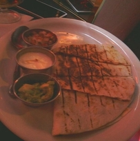
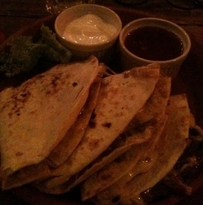
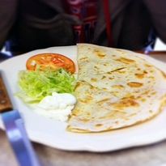
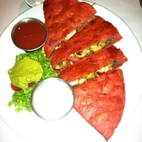
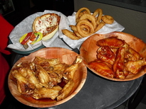
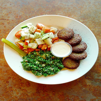
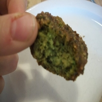
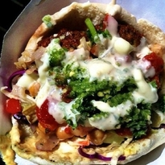
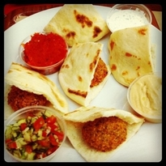

# Food-101

## Introduction

The purpose of this project is to classify images of food dishes into 101 classes. This is a huge dataset with 101,000 images. There are 1,000 images per class which is splitted into 750 training images and 250 test images.

## Overview 
The gentelmen who published this dataset stated that training images have some noise in the form of wrong labels and intense colors.

> We introduce a challenging data set of 101 food categories, with 101'000 images. For each class, 250 manually reviewed test images are provided as well as 750 training images. On purpose, the training images were not cleaned, and thus still contain some amount of noise. This comes mostly in the form of intense colors and sometimes wrong labels. All images were rescaled to have a maximum side length of 512 pixels.

If we look at some images from the dataset, we can see that these images are not taken by professionals with many images are over-exposed or under-exposed. Some of the images contain multiple dishes as well. 

 

*Examples of under-exposed image*

  

*Examples of over-exposed image*

*Example of image with multiple dishes*

*Example of a wrong label for _chicken_wings_!*

The dataset also has intra-class varience which makes it more difficult. Furthermore, there are similartity between some classes which makes it a hard task even for humans. 

    

*Sample of images for _falafel_*

All of the above suggestes that this is a really challgenging one.

## Methodology

The following summarizes the steps taken to tackle this project:
1. Initial experimentation to read and split the data, perform data augmentation, and choosing the architecture. Detailes are availabe in [this notebook]().
2. Build, train, and test and model. Details are available in [this notebook]().
3. Interpretation of the results. Details are available in [here]().

## Chanllenges

* Initially, it was difficult to read, label, and split the dataset as it doesn't conform with other popular datasets like _ImageNet_ or _MNIST_. I've seem many posts online that did lots of preprocessing to bring the dataset to a more popular format, but it didn't make much sence to me. Especially, given the large size of the dataset. This gave me the chance to dive into the details of fastai's *Datablock* API. I struggled with labeling using *label_from_folder* fuction, which assumed that files are read from a folder while I read it through a dataframe. I raised this issue and was addressed quickly by the fastai team. 

* Chossing the right augmentation parameters was a bit of a hassle, but visually inspecting the results helped a lot. 

* Fune tuning certain parameters like dropout rate and weight decay took some time and had a great effect on the performance of the model.

