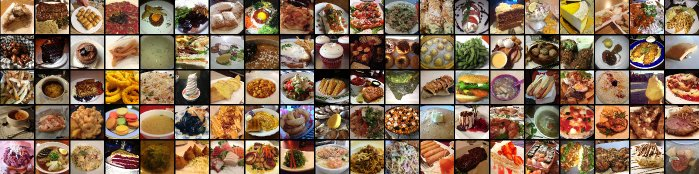
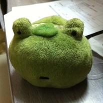

# Food-101

## Introduction

The purpose of this project is to classify images of food dishes into 101 classes. This is a huge dataset with 101000 images. There are 1000 images per class which is splitted into 750 training images and 250 test images.

## Chanllenges
The gentelmen who published this dataset stated that training images have some noise in the form of wrong labels and intense colors.

> We introduce a challenging data set of 101 food categories, with 101'000 images. For each class, 250 manually reviewed test images are provided as well as 750 training images. On purpose, the training images were not cleaned, and thus still contain some amount of noise. This comes mostly in the form of intense colors and sometimes wrong labels. All images were rescaled to have a maximum side length of 512 pixels.

If we look at random images from the dataset, we can see that these images are not taken by professionals with many images are over- or under-exposed. Some of the images contain multiple dishes as well. 

Example of under-exposed image
 

Example of over-exposed image
 

Example of multiple dishes

Example of a wrong label for `chicken_wings`!

The dataset also has intra-class varience which makes it more difficult. Furthermore, there are similartity between some classes which makes it a hard task even for humans. 

All of the above suggestes that this is a really challgenging one.

## Methodology

